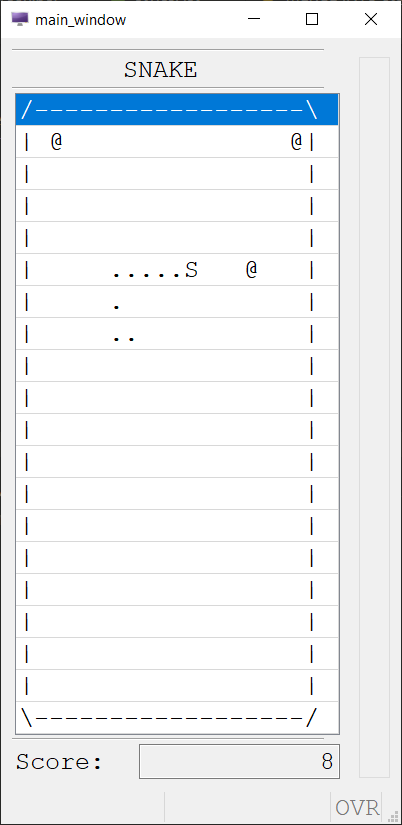

# 4gsnake
4gl Snake

Fun project I started when new to Genero
Quite possibly the first ever snake coded in genero :)

No warranty is provided, use at your own risk
Code might not even compile on your machine

### Controls
* Up / Down / Right / Left
* E to restart
* Q to quit

### Some features

### Some enhancements you could make:
* Redo the whole thing from scratch - code 🍝
* Two players?

Note: This was initially started (and the bulk of the programming done)
  one month after my being introduced to Genero so it's full of wonderful jank
